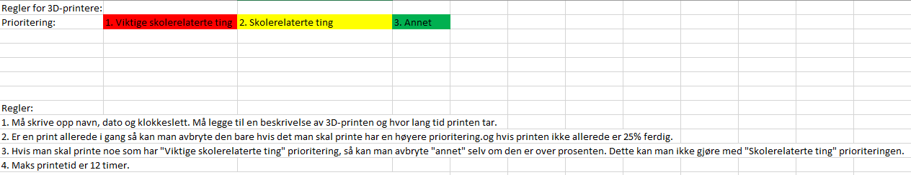

# 3D-Printere
## Ali og Ludde
3D-Printerene heter **Prusa I3 MK3S**.

Slicers som James har bestemt at vi skal bruke er: [PrusaSlicer](https://cdn.prusa3d.com/downloads/drivers/prusa3d_win_2_2_8.exe#_ga=2.168176611.334666038.1575547204-1800476386.1574322674). "[Prusa Handbook](https://cdn.prusa3d.com/downloads/manual/prusa3d_manual_mk3s_en_3_12.pdf#_ga=2.222300761.334666038.1575547204-1800476386.1574322674)" hvis man trenger det

Nozzle er på **0,4mm**, så husk på å konfigurere dette når du laster ned sliceren.

Vi Bruker SD-kort nå for å laste opp filer til 3D-printerene, og akkurat nå så er det bare Ali og Robin som har Pc-er med SD-kort slots.
Printerene har blitt satt opp med Raspberry Pi sånn at vi kan bruke [Octopi](https://octoprint.org/download/). Da skal vi kunne styre printerene via. nettet, og dette gjelder: opplasting, start/stopp av print, overvåking av printen osv. Kobler vi kameraer og røykvarslere til Raspberry Pi-esene så blir det mulig å passe på printen.
3D-Printerene trenger kabinetter rundt. Vi har tenkt å lage en selv. 

Vi har satt opp et nettverk i klasserommet med en midlertidig ruter(09.12.2019). Nettverket heter: Octoprint_Nett

Dette er reglene:

